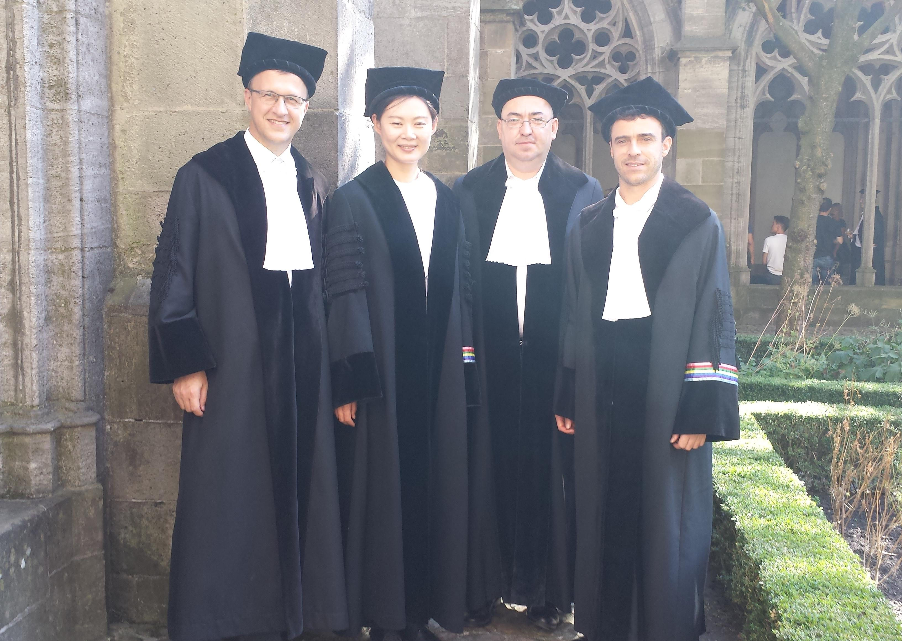

## postdocs

There is a number of postdocs who I have interacted with as mentor, host, or collaborator at MPIM. Here is a very incomplete list: Dave Carchedi, Maria Amelia Salazar, Giorgio Trentinaglia, Magdalini Flari, Camilo Arias Abad (Humboldt fellow), Joao Nuno Mestre, Honglei Lang, Michele Schiavina, Lada Peksova, Joel Villatoro, Florian Zeiser, Stephane Geudens, Marten Mol, Antonio Miti, Karendeep Singh, Luca Accornero, David Miyamoto, Alfonso Garmendia, Dan Wang

## current thesis students

### PhD

* [David Aretz](https://guests.mpim-bonn.mpg.de/aretz/) (joint with Pete Teichner, 2023-)
* [Janina Bernardy](https://guests.mpim-bonn.mpg.de/bernardy/about/) (2024-)

### Master

* Matías Viner
* Levani Iashvili
* Matthieu Wydra

## completed theses

### University of Bonn

#### PhD

* Annika Tarnowsky (2021-2026): The differentiable stack cohomology associated to a regular and proper Lie groupoid
* Lory Aintablian (2018-2025): [Differentiation of higher groupoid objects in tangent categories](https://bonndoc.ulb.uni-bonn.de/xmlui/bitstream/handle/20.500.11811/13688/8299.pdf?sequence=2&isAllowed=y)
* Néstor Léon Delgado (2014-2018): [Lagrangian field theories. Ind/pro-approach and L-infinity-algebra of local observables](https://bonndoc.ulb.uni-bonn.de/xmlui/bitstream/handle/20.500.11811/7534/5025.pdf?sequence=1&isAllowed=y)

#### Master

* Michele Lorenzi: The multisymplectic structure of Chern-Simons theory (09/2025)
* Matteo Del Vecchio: Vector fields on differentiable stacks (07/2025)
* Kai Käfer: The homotopy theory of multisymplectic structures (01/2025)
* Janina Bernardy: Homotopy reduction of multisymplectic structures and classical field theory (03/2024, &rarr; PhD student Univ. Bonn)
* Alessandro Nanto: The factorization algebra of a Lagrangian Field Theory (02/2024, &rarr; PhD student Univ. Greifswald)
* Luis Henriques: Homotopy momentum maps in Lagrangian Field Theories (05/2023)
* David Aretz: Cohomological extension of groupoid convolution (01/2023, &rarr; PhD student Univ. Bonn)
* Leonard Hofmann: The local splitting of higher Dirac structures and multisymplectic singularities (11/2022)
* Jakob Kraasch: Differentiation of L-infinity groupoids via ends (05/2022)
* Annika Tarnowsky: A derived approach to classical observables in Lagrangian Field Theory (09/2020, &rarr; PhD student Univ. Bonn)
* Stefano Ronchi: Hamiltonian Lie algebroids over Poisson manifolds (05/2020, &rarr; PhD student Univ. Göttingen)
* Giuseppe Gentile: The initial value problem of U(1)-gauge theory and presymplectic structures (11/2017, &rarr; PhD student Univ. Oldenburg)
* Lory Aintablian: Deformations of group and groupoid representations (11/2017, &rarr; PhD student Univ. Bonn)
* Theocharis Papantonis: Splitting theorems for Poisson and related structures (09/2017, &rarr; PhD student Univ. Göttingen)
* Felix Beck: Lie algebroid models for equivariant cohomology (09/2017)
* Elisa Atza: Deformations of Lie groupoids (07/2017)
* Néstor Léon Delgado: Multisymplectic structures and higher momentum maps (03/2014, &rarr; PhD student Univ. Bonn)

#### Bachelor

* Leon Schneider: Generalized Jacobi fields (04/2024)
* Jonah Epstein: The lagrangian field theory of generalized Jacobi fields (08/2020)
* David Aretz: The noncommutative geometry of symplectic singularities (07/2020, Prize for best graduating Bachelor students in mathematics 2019/20)
* Janina Bernardy: Noether's theorems in terms of variational cohomology (09/2019, Prize for best graduating Bachelor students in mathematics 2018/19)
* Konrad Kuangda Zou: Deformation theory and operads (07/2019)
* Paul Hege: Präquantisierung als Integration von Lie-Algebroiden (10/2016)
* Xiaowen Dong: Linearisierung von Poisson-Strukturen (08/2016)
* Kaan Öcal: Symplectic singularities and convolution algebras (08/2016, Prize for best graduating Bachelor students in mathematics 2015/16)
* Jonas Mahnkopp: Mannigfaltigkeiten nichtnegativer Ricci-Krümmung (09/2015)
* Georg Gawenda: Mannigfaltigkeiten nichtnegativer Schnittkrümmung (09/2015)
* Max Körfer: Dirac manifolds and symplectic singularities (11/2014)

### University of Regensburg

* Sandro Englhardt (Zulassungsarbeit, 11/2011)
* Stefan Forster (Zulassungsarbeit, 10/2010)
* Angela Carofiglio (Zulassungsarbeit, 06/2010)

{: style="width: 300px; float: right"}

## PhD committees

* Raffaele Lomartire (University of Zurich)
* Kalin Krishna (Göttingen)
* Bjarne Kosmeijer (University of Amsterdam 05/2023)
* Luca Accornero (Utrecht 10/2021)
* Leyli Mammadova (KU Leuven 08/2020)
* Francesco Cattafi (Utrecht 02/2020)
* Ralph Klaasse (Utrecht 08/2017)
* Ori Yudilevich (Utrecht 09/2016)
* Joao Nuno Mestre (Utrecht 02/2016)
* Li Du (Göttingen 07/2014)
* Maria Amelia Salazar (Utrecht 05/2013)
* David Carchedi (Utrecht 09/2011)
